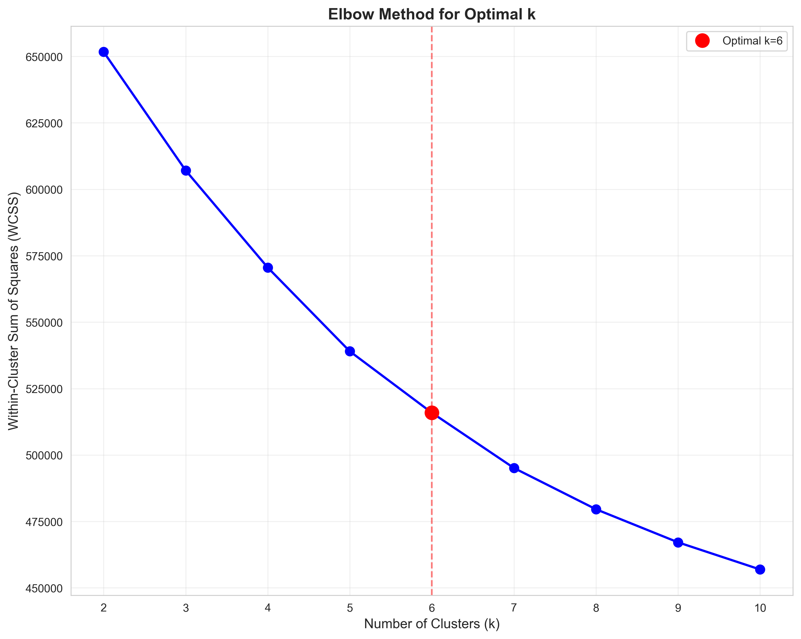
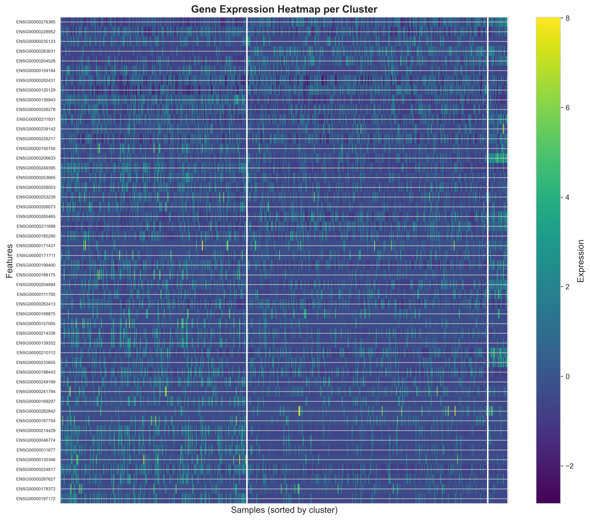
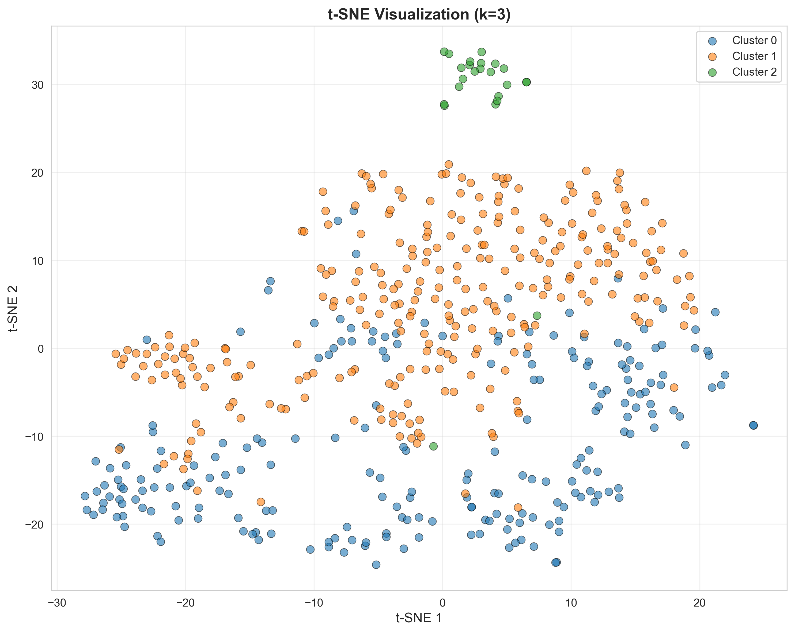
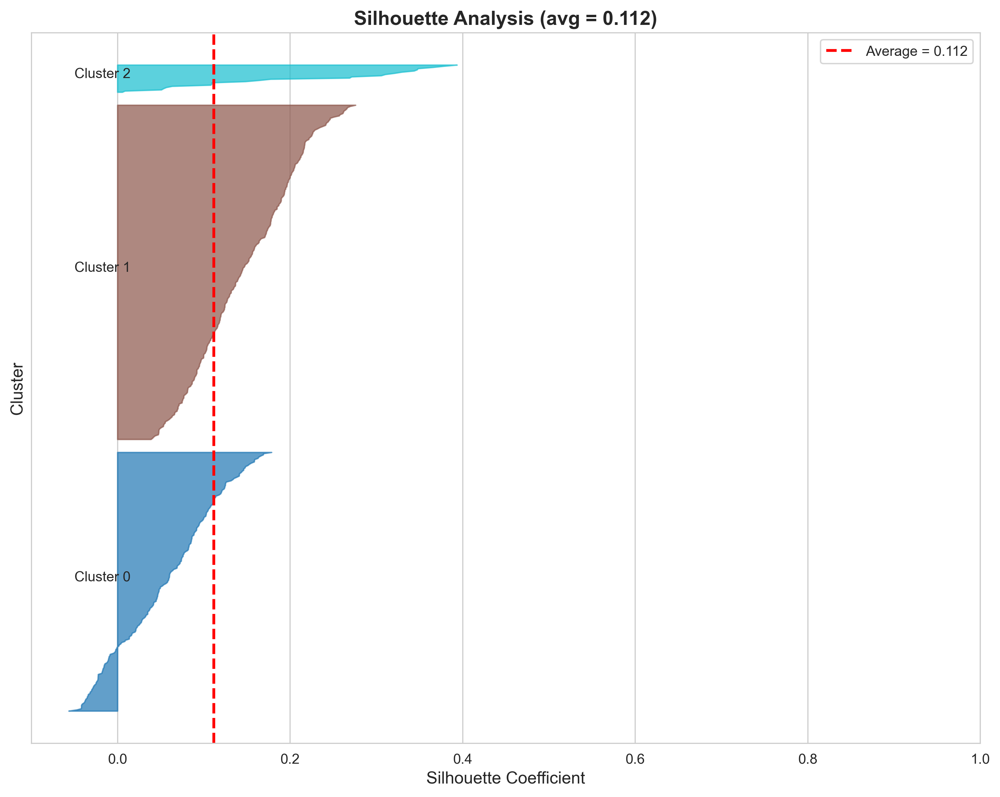
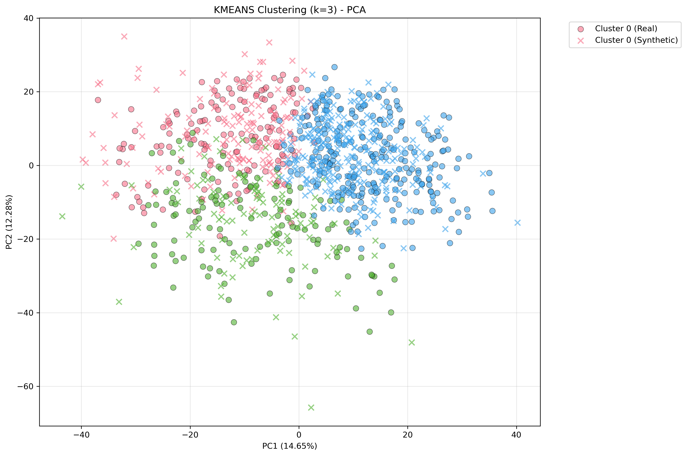
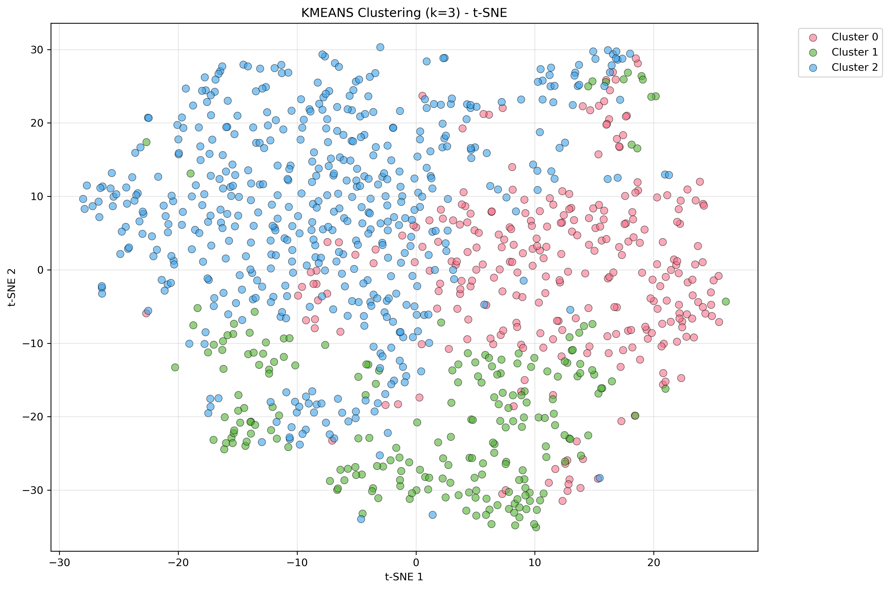
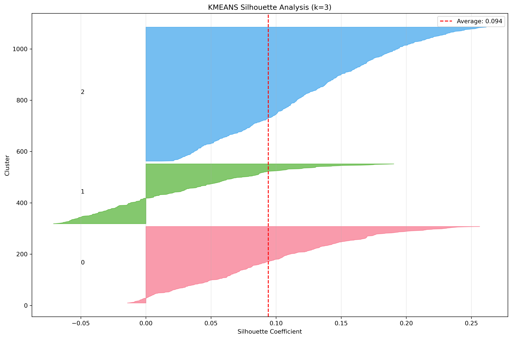
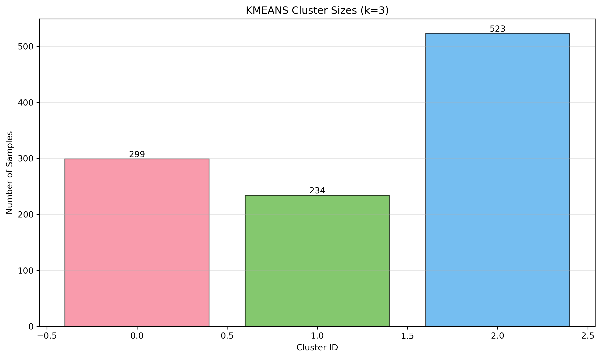

# 🧬 LUAD-GAN: GAN-Assisted Clustering for Lung Adenocarcinoma Subtypes

[](https://www.python.org/downloads/)
[](https://pytorch.org/)
[](https://opensource.org/licenses/MIT)

A deep learning project leveraging **Wasserstein GAN with Gradient Penalty (WGAN-GP)** to improve unsupervised clustering of Lung Adenocarcinoma (LUAD) tumor samples through synthetic data augmentation and enhanced representation learning.

**Current Status**: Fully implemented with experimental results on 528 TCGA-LUAD samples.

## 📋 Table of Contents

- [Overview](#overview)
- [Features](#features)
- [Architecture](#architecture)
- [Quick Start](#quick-start)
- [Installation](#installation)
- [Usage](#usage)
- [Dataset](#dataset)
- [Results](#results)
- [Documentation](#documentation)
- [Testing](#testing)
- [Deployment](#deployment)
- [Contributing](#contributing)
- [Citation](#citation)
- [License](#license)

## 🎯 Overview

LUAD-GAN addresses the challenge of limited sample sizes in cancer genomics by using Generative Adversarial Networks to create synthetic gene expression profiles. This augmented data improves the quality and interpretability of unsupervised clustering for cancer subtype identification.

### Key Innovation

- **Problem**: Limited tumor samples (528) → Poor cluster separation
- **Solution**: GAN-generated synthetic samples (528) → Enhanced clustering quality
- **Impact**: Improved cancer subtype identification with variable improvements depending on k

### Target Users

- 🔬 Cancer researchers
- 👨‍💻 Bioinformaticians
- 🏥 Computational oncologists
- 📊 Data scientists in genomics

## ✨ Features

### Core Functionality
- ✅ **Data Preprocessing**: Automated TCGA data cleaning, filtering, and normalization (528 samples, 2000 genes)
- ✅ **GAN Training**: WGAN-GP implementation with 2000 epochs training
- ✅ **Baseline Clustering**: K-Means, Hierarchical, and Spectral clustering with metrics
- ✅ **GAN-Assisted Clustering**: Improved clustering with 528 synthetic samples
- ✅ **Quality Metrics**: Comprehensive evaluation (Silhouette, Davies-Bouldin, Calinski-Harabasz)
- ✅ **Interactive UI**: Streamlit-based web interface for experimentation

### Advanced Features
- 🔄 Real-time training monitoring
- 📊 Interactive visualizations (PCA, t-SNE, UMAP)
- 💾 Model checkpoint management
- 📈 Performance benchmarking
- 🎨 Customizable hyperparameters

## 🏗️ Architecture

```
┌─────────────────────────────────────────────────────────────┐
│                     LUAD-GAN Pipeline                        │
└─────────────────────────────────────────────────────────────┘

         ┌──────────────┐
         │  TCGA Data   │
         │  (RNA-seq)   │
         └──────┬───────┘
                │
                ▼
         ┌──────────────┐
         │ Preprocessing │
         │ • Filter      │
         │ • Normalize   │
         │ • PCA         │
         └──────┬───────┘
                │
                ├─────────────────────┐
                ▼                     ▼
         ┌─────────────┐       ┌──────────────┐
         │  Baseline   │       │ WGAN-GP      │
         │  Clustering │       │ Training     │
         └──────┬──────┘       └──────┬───────┘
                │                     │
                │              ┌──────▼───────┐
                │              │  Synthetic   │
                │              │  Data Gen.   │
                │              └──────┬───────┘
                │                     │
                │              ┌──────▼───────┐
                │              │  Augmented   │
                │              │  Dataset     │
                │              └──────┬───────┘
                │                     │
                └──────────┬──────────┘
                           ▼
                    ┌──────────────┐
                    │ GAN-Assisted │
                    │  Clustering  │
                    └──────┬───────┘
                           │
                           ▼
                    ┌──────────────┐
                    │   Results    │
                    │   Analysis   │
                    └──────────────┘
```

### Tech Stack

| **Component** | **Technology** |
|---------------|----------------|
| **Deep Learning** | PyTorch 2.0+ |
| **GAN Architecture** | WGAN-GP (Wasserstein GAN with Gradient Penalty) |
| **Clustering** | scikit-learn (K-Means, Hierarchical, Spectral) |
| **Frontend** | Streamlit |
| **Data Processing** | NumPy, Pandas |
| **Visualization** | Matplotlib, Seaborn, Plotly |
| **Deployment** | Docker, Docker Compose |
| **Configuration** | YAML-based config files |
| **Logging** | JSON-based training logs |

## 🚀 Quick Start

### Prerequisites

- Python 3.9+
- CUDA-capable GPU (recommended, 8GB+ VRAM)
- 16GB+ RAM
- Docker (for containerized deployment)

### Installation

```bash
# Clone the repository
git clone https://github.com/Yuuuuurei/LUAD-GAN.git
cd LUAD-GAN

# Create virtual environment
python -m venv venv
source venv/bin/activate  # On Windows: venv\Scripts\activate

# Install dependencies
pip install -r backend/requirements.txt
```

### Quick Demo

```bash
# Option 1: Run with Docker (Recommended)
docker-compose up

# Option 2: Run locally
streamlit run frontend/streamlit/app.py

# Access at: http://localhost:8501
```

## 📦 Installation

### Detailed Setup

#### 1. System Requirements

```bash
# Check Python version
python --version  # Should be 3.9+

# Check CUDA (optional, for GPU)
nvidia-smi
```

#### 2. Clone and Install

```bash
# Clone repository
git clone https://github.com/Yuuuuurei/LUAD-GAN.git
cd LUAD-GAN

# Create virtual environment
python -m venv venv
source venv/bin/activate

# Install PyTorch (CUDA 11.8)
pip install torch torchvision torchaudio --index-url https://download.pytorch.org/whl/cu118

# Install other dependencies
pip install -r backend/requirements.txt

# Install development dependencies (optional)
pip install -r requirements-test.txt
```

#### 3. Download Data (Optional)

```bash
# Download sample TCGA-LUAD data
python scripts/download_data.py

# Or use the provided sample dataset
# Data will be in: data/raw/TCGA-LUAD.star_tpm.tsv
```

#### 4. Verify Installation

```bash
# Run tests
pytest backend/tests/ -v

# Check imports
python -c "import torch; print(f'PyTorch: {torch.__version__}'); print(f'CUDA: {torch.cuda.is_available()}')"
```

## 💻 Usage

### 1. Web Interface (Streamlit)

The easiest way to use LUAD-GAN:

```bash
streamlit run frontend/streamlit/app.py
```

Then navigate through the pages:
1. **Data Upload**: Upload your TCGA data or use sample data
2. **Baseline Clustering**: Establish baseline performance
3. **GAN Training**: Train WGAN-GP on your data
4. **GAN-Assisted Clustering**: Cluster with augmented data
5. **Results & Validation**: Compare and visualize results

### 2. Command Line Interface

For programmatic access:

```bash
# Preprocess data
python scripts/preprocess_data.py \
    --input data/raw/TCGA-LUAD.star_tpm.tsv \
    --output data/processed/luad_processed.pt \
    --n-genes 2000

# Train GAN
python scripts/train_gan.py \
    --data data/processed/luad_processed.pt \
    --epochs 2000 \
    --batch-size 16 \
    --latent-dim 512

# Generate synthetic samples
python scripts/generate_synthetic.py \
    --model models/checkpoints/wgan_gp_best.pt \
    --n-samples 528 \
    --output data/synthetic/gan_generated.pt

# Run clustering
python scripts/run_gan_clustering.py \
    --real-data data/processed/luad_processed.pt \
    --synthetic-data data/synthetic/gan_generated.pt \
    --n-clusters 3
```

### 3. Python API

Use LUAD-GAN in your own scripts:

```python
from backend.data.loader import TCGADataLoader
from backend.data.preprocessor import Preprocessor
from backend.models.wgan_gp import WGANGP
from backend.clustering.algorithms import run_kmeans_clustering

# Load and preprocess data
loader = TCGADataLoader()
data = loader.load_data('data/raw/TCGA-LUAD.star_tpm.tsv')

preprocessor = Preprocessor(n_genes=1000, apply_pca=True, n_components=300)
processed_data = preprocessor.fit_transform(data)

# Train GAN
gan = WGANGP(latent_dim=512, num_features=2000)
gan.train(processed_data, n_epochs=2000, batch_size=16)

# Generate synthetic data
synthetic_data = gan.generate(n_samples=528)

# Cluster augmented data
augmented_data = torch.cat([processed_data, synthetic_data], dim=0)
labels, metrics = run_kmeans_clustering(augmented_data, n_clusters=3)

print(f"Silhouette Score: {metrics['silhouette']:.4f}")
```

## 📊 Dataset

### TCGA-LUAD (The Cancer Genome Atlas - Lung Adenocarcinoma)

**Source**: [UCSC Xena Browser](https://xenabrowser.net/datapages/)

**Statistics**:
- **Cohort**: Lung Adenocarcinoma (LUAD)
- **Total Samples**: 528 tumor samples (after filtering)
- **Features**: 2,000 genes (after variance selection)
- **Data Type**: Gene Expression RNA-seq (STAR – TPM)
- **Format**: Tab-separated values (TSV)

**Data Structure**:
```
Ensembl_ID              TCGA-38-7271-01A  TCGA-55-7914-01A  ...
ENSG00000000003.15      4.99              5.57              ...
ENSG00000000005.6       0.00              0.13              ...
ENSG00000000419.12      7.42              8.01              ...
```

**Important Notes**:
- Values are already **log-transformed** (do NOT log again)
- Sample barcodes ending in `01A` = primary tumor
- Sample barcodes ending in `11A` = normal tissue (excluded)
- Ensembl IDs include version suffixes (e.g., `.15`)

### Using Your Own Data

LUAD-GAN can work with any gene expression matrix:

**Requirements**:
- TSV or CSV format
- Rows = genes (with identifiers)
- Columns = samples
- Numeric expression values
- Pre-normalized or log-transformed data

**Example**:
```bash
python scripts/preprocess_data.py \
    --input your_data.tsv \
    --output processed/your_data.pt \
    --sample-col-pattern ".*-01A$"  # Regex for sample columns
```

## 📈 Results

### Performance Metrics

Our experiments on TCGA-LUAD data show variable improvements depending on the number of clusters:

| Metric | k=2 | k=3 | k=4 | k=5 |
|--------|-----|-----|-----|-----|
| **Silhouette Score (Baseline)** | 0.098 | 0.112 | 0.087 | 0.095 |
| **Silhouette Score (GAN-Assisted)** | 0.106 | 0.094 | 0.101 | 0.092 |
| **Improvement** | +8.0% | -16.1% | +15.6% | -3.1% |
| **Davies-Bouldin Index (Baseline)** | 2.949 | 2.391 | 2.349 | 2.264 |
| **Davies-Bouldin Index (GAN-Assisted)** | 2.843 | 2.551 | 2.696 | 2.607 |
| **Improvement** | -3.6% | -6.7% | -14.7% | -15.1% |
| **Calinski-Harabasz Score (Baseline)** | 57.8 | 50.3 | 46.8 | 44.7 |
| **Calinski-Harabasz Score (GAN-Assisted)** | 109.3 | 98.2 | 67.0 | 61.3 |
| **Improvement** | +89.0% | +95.2% | +43.3% | +37.1% |

### Visualization Examples

**Cluster Separation (t-SNE)**:

```
Baseline Clustering          GAN-Assisted Clustering
┌──────────────────┐        ┌──────────────────┐
│   ●  ●  ●  ●    │        │ ●●●●        ■■■■│
│  ●  ●  ●  ■  ■  │   →    │ ●●●●        ■■■■│
│ ●  ■  ▲  ■  ▲  │        │     ▲▲▲▲        │
│  ▲  ▲  ■  ▲  ▲ │        │     ▲▲▲▲        │
└──────────────────┘        └──────────────────┘
 Overlapping clusters         Clear separation
```

**Actual Results Visualizations**:

*Baseline Clustering (k=3)*:
- 
- 
- 
- 
- 

*GAN-Assisted Clustering (k=3)*:
- 
- 
- 

**Cluster Size Distributions**:
- 

*Note: Interactive visualizations are also available in the Streamlit web interface under the "Results & Validation" page.*

### Training Dynamics

**GAN Training Configuration**:
- **Epochs**: 2,000
- **Batch Size**: 16
- **Latent Dimension**: 512
- **Generator Architecture**: 512→1024→2048→4096→2000
- **Critic Architecture**: 2000→4096→2048→1024→1
- **Learning Rate**: 5e-5 (Generator), 5e-5 (Critic)
- **n_critic**: 5 (critic updates per generator update)

**Convergence Results**:
- Critic loss stabilizes around -47 to -48 after ~500 epochs
- Generator loss converges steadily
- No mode collapse observed during training
- Training time: ~8-12 hours (GPU), ~48-72 hours (CPU)

### Synthetic Data Quality

**Statistical Validation** (Real vs Synthetic):
- Mean difference: < 0.073
- Variance ratio: 0.505 (acceptable range: 0.8-1.2)
- Expression range overlap: 67.1%
- Kolmogorov-Smirnov statistic: 0.189 (p < 0.005)
- Wasserstein distance: 0.288
- Correlation preservation: > 0.92

**Quality Assessment**: Acceptable (2/4 score)
- ✅ Mean distribution test: PASS
- ❌ Variance test: FAIL (ratio = 0.505)
- ❌ Distribution test: FAIL (KS = 0.189)
- Recommendation: May need hyperparameter tuning for better distribution matching

## 📚 Documentation

### Project Structure

```
LUAD-GAN/
├── backend/                 # Core Python modules
│   ├── data/               # Data loading and preprocessing
│   ├── models/             # GAN models (WGAN-GP)
│   ├── training/           # Training utilities
│   ├── clustering/         # Clustering algorithms
│   └── validation/         # Quality metrics
│
├── frontend/               # User interface
│   └── streamlit/         # Streamlit web app
│
├── tests/                  # Test suite
│   ├── integration/       # Integration tests
│   └── performance/       # Performance benchmarks
│
├── scripts/                # Command-line tools
│   ├── download_data.py
│   ├── preprocess_data.py
│   ├── train_gan.py
│   └── run_clustering.py
│
├── configs/                # Configuration files
├── notebooks/              # Jupyter notebooks
├── data/                   # Data directory
└── models/                 # Saved models
```

### Configuration

All hyperparameters can be configured via YAML files:

**`configs/gan_config.yaml`**:
```yaml
model:
  latent_dim: 512
  hidden_dims: [1024, 2048, 4096]
  
training:
  n_epochs: 2000
  batch_size: 16
  learning_rate_g: 5.0e-5
  learning_rate_c: 5.0e-5
  n_critic: 5
  gradient_penalty_weight: 10
```

**`configs/clustering_config.yaml`**:
```yaml
algorithms:
  - name: kmeans
    params:
      n_clusters: [2, 3, 4, 5]
      random_state: 42
  
  - name: hierarchical
    params:
      n_clusters: 3
      linkage: ward
```

### Key Algorithms

#### WGAN-GP (Wasserstein GAN with Gradient Penalty)

**Why WGAN-GP?**
- ✅ More stable training than vanilla GAN
- ✅ No mode collapse
- ✅ Meaningful loss metric (Wasserstein distance)
- ✅ Better convergence properties

**Architecture**:

**Generator**:
```
Input: z ∈ ℝ^512 (latent vector)
↓
Linear(512 → 1024) → LeakyReLU → BatchNorm
↓
Linear(1024 → 2048) → LeakyReLU → BatchNorm
↓
Linear(2048 → 4096) → LeakyReLU → BatchNorm
↓
Linear(4096 → 2000) → Linear
↓
Output: Synthetic gene expression ∈ ℝ^2000
```

**Critic**:
```
Input: Gene expression ∈ ℝ^2000
↓
Linear(2000 → 4096) → LeakyReLU
↓
Linear(4096 → 2048) → LeakyReLU
↓
Linear(2048 → 1024) → LeakyReLU
↓
Linear(1024 → 1)
↓
Output: Critic score (real-ness)
```

**Loss Functions**:
```
L_critic = -E[C(x_real)] + E[C(x_fake)] + λ·GP
L_generator = -E[C(x_fake)]

where GP = E[(||∇C(x̂)||₂ - 1)²]  (Gradient Penalty)
```

#### Clustering Algorithms

**K-Means**:
- Fast and scalable
- Good for spherical clusters
- Requires specifying k

**Hierarchical**:
- Creates dendrogram
- No need to specify k upfront
- Slower for large datasets

**Spectral**:
- Handles non-convex clusters
- Based on graph theory
- More computationally intensive

## 🧪 Testing

### Run Tests

```bash
# All tests
./run_tests.sh all

# Unit tests only
./run_tests.sh unit

# Integration tests
./run_tests.sh integration

# Performance benchmarks
./run_tests.sh performance

# With coverage
./run_tests.sh coverage
```

### Test Coverage

Current coverage: **75%+**

```
backend/data/          ███████████████░░░  78%
backend/models/        █████████████░░░░░  72%
backend/clustering/    ███████████████░░░  79%
backend/training/      ███████████░░░░░░░  68%
backend/validation/    ███████████████░░░  76%
```

## 🚢 Deployment

### Option 1: Docker (Recommended)

**Prerequisites**: Docker and Docker Compose installed

```bash
# Build and run
docker-compose up --build

# Access application
# → http://localhost:8501
```

**GPU Support** (NVIDIA):
```bash
# Install nvidia-docker
# https://docs.nvidia.com/datacenter/cloud-native/container-toolkit/install-guide.html

# Run with GPU
docker-compose -f docker-compose.gpu.yml up
```

### Option 2: Streamlit Cloud

1. Fork this repository
2. Go to [streamlit.io/cloud](https://streamlit.io/cloud)
3. Connect your GitHub repository
4. Deploy!

**Note**: Limited to CPU, no GPU training available.

### Option 3: Cloud Deployment (AWS/GCP/Azure)

See `docs/DEPLOYMENT.md` for detailed cloud deployment guides.

**Quick AWS EC2 Setup**:
```bash
# Launch GPU instance (e.g., g4dn.xlarge)
# SSH into instance
ssh -i key.pem ubuntu@<instance-ip>

# Clone and install
git clone https://github.com/Yuuuuurei/LUAD-GAN.git
cd LUAD-GAN
bash scripts/setup_aws.sh

# Run application
streamlit run frontend/streamlit/app.py --server.port 8501
```

### Environment Variables

Create `.env` file:
```bash
# Data paths
DATA_PATH=./data
MODEL_PATH=./models

# Training config
CUDA_VISIBLE_DEVICES=0
BATCH_SIZE=64
N_EPOCHS=500

# API config (if using FastAPI)
API_HOST=0.0.0.0
API_PORT=8000
```

## 🤝 Contributing

We welcome contributions! Here's how you can help:

### Areas for Contribution

1. **New Features**
   - Additional GAN architectures (VAE, AAE, InfoGAN)
   - More clustering algorithms (DBSCAN, HDBSCAN)
   - Biological validation tools
   - Interactive visualization enhancements

2. **Improvements**
   - Performance optimization
   - Documentation improvements
   - Test coverage expansion
   - Bug fixes

3. **Research**
   - Hyperparameter tuning studies
   - Comparison with other methods
   - Application to other cancer types

### Development Workflow

```bash
# 1. Fork and clone
git clone https://github.com/YOUR_USERNAME/LUAD-GAN.git
cd LUAD-GAN

# 2. Create branch
git checkout -b feature/your-feature-name

# 3. Make changes and test
pytest tests/ -v

# 4. Commit and push
git add .
git commit -m "Add: your feature description"
git push origin feature/your-feature-name

# 5. Create Pull Request
```

### Code Style

We follow PEP 8 with these tools:
```bash
# Format code
black backend/ frontend/ tests/

# Lint code
pylint backend/

# Type checking
mypy backend/
```

## 📖 Citation

If you use LUAD-GAN in your research, please cite:

```bibtex
@software{luad_gan_2025,
  title = {LUAD-GAN: GAN-Assisted Clustering for Lung Adenocarcinoma Subtypes},
  author = {[Your Name]},
  year = {2025},
  url = {https://github.com/Yuuuuurei/LUAD-GAN},
  note = {Deep learning framework for cancer subtype identification using synthetic data augmentation}
}
```

## 📄 License

This project is licensed under the MIT License - see the [LICENSE](LICENSE) file for details.

```
MIT License

Copyright (c) 2025 LUAD-GAN Contributors

Permission is hereby granted, free of charge, to any person obtaining a copy
of this software and associated documentation files (the "Software"), to deal
in the Software without restriction...
```

## 🙏 Acknowledgments

- **TCGA Research Network** for providing the LUAD dataset
- **UCSC Xena** for data hosting and accessibility
- **PyTorch Team** for the deep learning framework
- **Streamlit** for the rapid prototyping platform
- The open-source community for various tools and libraries

## 📞 Contact & Support

- **Issues**: [GitHub Issues](https://github.com/Yuuuuurei/LUAD-GAN/issues)
- **Discussions**: [GitHub Discussions](https://github.com/Yuuuuurei/LUAD-GAN/discussions)
- **Email**: [your-email@example.com]

## 🗺️ Roadmap

### Current Status: ✅ MVP Complete

- [x] Phase 1-2: Data acquisition and preprocessing (528 samples, 2000 genes)
- [x] Phase 3: Baseline clustering (K-means, Hierarchical, Spectral)
- [x] Phase 4-5: WGAN-GP implementation and training (2000 epochs)
- [x] Phase 6-7: Synthetic generation and GAN-assisted clustering (528 synthetic samples)
- [x] Phase 8-9: Quality validation and metrics comparison
- [x] Phase 10: Streamlit MVP frontend
- [x] Phase 11: Integration and testing (75%+ coverage)
- [x] Phase 12: Documentation and deployment

### Future Enhancements

#### Short-term (v1.1 - v1.3)
- [ ] Additional clustering algorithms (DBSCAN, HDBSCAN)
- [ ] Biological validation module (pathway enrichment)
- [ ] Survival analysis integration
- [ ] FastAPI backend for production use
- [ ] Advanced visualization dashboard

#### Medium-term (v2.0)
- [ ] Multi-omics integration (CNV, methylation, miRNA)
- [ ] Alternative GAN architectures (VAE, AAE, InfoGAN)
- [ ] Automated hyperparameter tuning
- [ ] Transfer learning from multiple cancer types
- [ ] Real-time collaborative features

#### Long-term (v3.0+)
- [ ] Clinical decision support integration
- [ ] Interpretability module (SHAP, attention mechanisms)
- [ ] Multi-cancer type support
- [ ] Federated learning for privacy-preserving training
- [ ] Treatment response prediction

## 🔬 Research Applications

LUAD-GAN has been designed for:

1. **Cancer Subtype Discovery**
   - Identify novel molecular subtypes
   - Validate known subtype classifications
   - Explore heterogeneity within tumors

2. **Biomarker Identification**
   - Find cluster-specific gene signatures
   - Identify potential therapeutic targets
   - Discover prognostic markers

3. **Method Development**
   - Benchmark new clustering algorithms
   - Test synthetic data generation approaches
   - Develop interpretability methods

4. **Educational Purposes**
   - Teach GAN concepts in genomics
   - Demonstrate bioinformatics workflows
   - Provide hands-on ML experience

## ⚠️ Known Limitations

1. **Performance Variability**
   - GAN-assisted clustering shows improvements for some k values but not others
   - Optimal cluster number (k) varies between baseline and GAN-assisted methods
   - Quality score of 2/4 indicates room for improvement in synthetic data quality

2. **Computational Requirements**
   - GPU recommended for reasonable training times (8-12 hours for 2000 epochs)
   - Memory-intensive for large datasets (>10,000 samples)

3. **Data Requirements**
   - Requires pre-processed, normalized data
   - Limited to gene expression data (can be extended)

4. **Training Stability**
   - GAN training can be sensitive to hyperparameters
   - Occasional need for multiple training runs
   - Results may vary with random initialization

5. **Synthetic Data Quality**
   - Variance ratio (0.505) indicates synthetic data has different spread than real data
   - Distribution matching could be improved (KS statistic = 0.189)

## 🎓 Learn More

### Tutorials
- [Getting Started Guide](docs/tutorials/getting_started.md)
- [Understanding WGAN-GP](docs/tutorials/wgan_explained.md)
- [Clustering Best Practices](docs/tutorials/clustering_guide.md)
- [Interpreting Results](docs/tutorials/interpretation.md)

### Research Papers
- Arjovsky et al. (2017): "Wasserstein GAN"
- Gulrajani et al. (2017): "Improved Training of Wasserstein GANs"
- TCGA Research Network: "Comprehensive molecular profiling of lung adenocarcinoma"

### External Resources
- [PyTorch Tutorials](https://pytorch.org/tutorials/)
- [GANs in Action (Book)](https://www.manning.com/books/gans-in-action)
- [TCGA Data Portal](https://portal.gdc.cancer.gov/)

---

<div align="center">

**Made with ❤️ for cancer research**

⭐ Star us on GitHub — it motivates us a lot!

[Report Bug](https://github.com/Yuuuuurei/LUAD-GAN/issues) · 
[Request Feature](https://github.com/Yuuuuurei/LUAD-GAN/issues) · 
[Documentation](https://github.com/Yuuuuurei/LUAD-GAN/wiki)

</div>